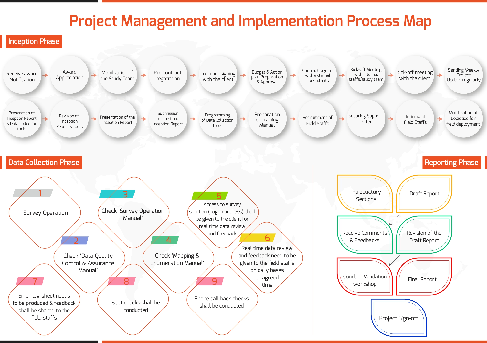

# Phases of Project Implementation

The project life cycle represents the stages a project must go through from the beginning to its end. The project life cycle may vary from one organization to another but in general, it includes the following main phases:

1.  Project Initiation

2.  Project Preparation

3.  Project Implementation

4.  Project Completion.

In a typical consultancy project, there are four major project implementation phases: Inception, Data Collection, Reporting, and post-sign off phases. Each of these phases, in turn, consists of various tasks and sub-tasks as described in the following diagram.

## Major Activities during the Inception Phase

::: callout-note
While the data collection and reporting phase is by far the most resource intensive part of the project implementation, it is the care and effort devoted to inception phase that makes the most significant contribution to project success.
:::

### Receive award Notification

The inception of any project starts on receiving award notification, which can be done either through official letter or email messages. The delegated person/BDD shall send acknowledgment letter/email to the client and share the message immediately to the members of the relevant division who took part in the proposal preparation activities and the management.

| Major activities                                          | Duration/Time                                      | Responsible          |
|-----------------------------|-------------------------|------------------|
| Send acknowledgement letter                               | within 24 hours from the time the message recived  | Delegated person/BDD |
| Share award notification to respective divisions and team | Within 24 hours from the time the message received | Delegated person/BDD |

### Award Appreciation and Assigning project manager

Once the award notification is obtained, it is important to conduct a brief meeting by members of the division that are expected to execute the project .

| Major activities                   | Duration/Time                                              | Responsible            |
|---------------------|---------------------------------|------------------|
| Assign Project Manager             | within two working days from the date the award received   | Division director      |
| Conduct award appreciation meeting | within three working days from the date the award received | Project manager & team |

### Mobilization of project team

Once the project manager is assigned, she/he shall contact and assemble the study team immediately, and check their availability and potential engagement in the project. The project manager shall share the ToR and the 'Technical Approach and Method' section of the proposal with the study team so as to let them review the nature of the work before they sign their contract. In the case where anyone in the proposed team is not in a position to engage in the project, immediate action should be taken to look for potential candidates for replacement.

| Major activities    | Duration/Time                                                      | Responsible     |
|---------------------|---------------------------------|------------------|
| Key staff contacted | within two working days from the date the project manager assigned | Project manager |

### Contract signing with the client

Contract signing is the first milestone for official commencement of the project. The contract shall be signed after a careful review of all terms and conditions of the contract.

| Major activities                  | Duration/Time                                      | Responsible        |
|---------------------|---------------------------------|------------------|
| Contracted signed with the client | Depends on the terms and condition of the contract | Operation Director |

### Contract signing with external consultant

The project manager should draft a contract agreement for each external consultant and share it to them for their review and feedback. The contract should clearly indicate the roles, responsibilities, expected deliverable, timeframe, budget amount, payment installments, and other mandatory requirements, such as training facilitation and field observation activities.

| Major activities                            | Duration/Time                           | Responsible     |
|--------------------|----------------------------------|------------------|
| Contracted signed with external consultants | Before kick of meeting with the clienet | Project manager |

### Kick off meeting with internal staff and Study team

An internal kick-off meeting with the study team should be conducted prior to the first meeting with the client.

::: callout-tip
The purpose of the kick off meeting is to have a clear understanding of the objective, scope, technical approach, and methodology of the assignment as well as deliverables and timeframe.
:::

| Major activities                             | Duration/Time                           | Responsible                    |
|--------------------|----------------------------------|------------------|
| Conduct kick off meeting with internal staff | Before kick of meeting with the clienet | Project manager and study team |

### Kick of meeting with the client

This is the first technical meeting to be held with the client aiming at reaching a common understanding on the overall understanding, objective, scope, timeframe and deliverables of the project.

| Major activities                    | Duration/Time                            | Responsible                    |
|--------------------|----------------------------------|------------------|
| prior notification to the key staff | four working days in advance             | Project manager                |
| Prepare PPT and rehearse            | two working days in advance              | Project manager and study team |
| Conduct the kick off meeting        | Based on agreed timeline with the client | All key staff                  |

### Weekly project update

weekly updates on project implementation status shall be sent every Friday regularly to the client.

::: callout-important
Updates Should be sent via email with short and precise messages pin-pointing major activities performed over the week. Relevant stakeholders need to be copied in the email correspondences to ensure effective stakeholder engagement in the overall project implementation activities.

The email should include the following phrase:

*Should you have any complaints/reservations on any of the project implementation issues, please feel free to send your complaints to Frontieri IQA Unit via clientcare\@frontieri.com*
:::

| Major activities             | Duration/Time                            | Responsible                    |
|--------------------|---------------------------------|-------------------|
| Send weekly project update   | Every Friday                             | Project manager                |
| Prepare PPT and rehearse     | two working days in advance              | Project manager and study team |
| Conduct the kick off meeting | Based on agreed timeline with the client | All key staff                  |

### Preparation of inception report and data collection tools

Without careful planning it is likely that the project will fail to achieve its objectives. Thus, the study team shall start the preparation of the inception report and data collection tools immediately after the kick-off meeting.

| Major activities         | Duration/Time                          | Responsible                     |
|--------------------|---------------------------------|-------------------|
| Prepare inception report | immediately after the kick off meeting | Project manager and team leader |

::: callout-note
The project manager should ensure that all the study team are engaged in the preparation of the inception report & the objectives of the study as well as the research questions are fully addressed with the proposed data collection tools. In addition, it is important to ensure that the inception report and data collection tools are submitted on time.
:::

### Revision of the inception report

After submission of inception report and data collection tools, the project manager is expected to do a serious follow-up of the client to get timely feedback. once the comments are received, both the inception report and data collection tools should be revised accordingly.

::: callout-note
The project manager shall make sure that all comments are properly addressed and response to comments is provided in a separate file either in track changes or response matrix format.
:::

| Major activities                                              | Duration/Time                           | Responsible                     |
|--------------------|---------------------------------|-------------------|
| Revise inception report and data collection tools             | Immediately after comments are received | Project manager and team leader |
| Submit the revised inception report and data collection tools | Depending the client's requast          | Project manager and team leader |

### Presentation of the inception report

A consultation workshop, with the presence of major stakeholders, shall be organized to present the revised inception report and major contents of the data collection tools.

::: callout-caution
-   The project manager, along with the team leader and the rest of the team members, shall be responsible to prepare the PPT ahead of the workshop and make the rehearsal beforehand.

-   The study team shall avail itself to this workshop, and the project manager shall be responsible for timely notification of the workshop date and venue at least one week ahead.
:::

| Major activities                         | Duration/Time                | Responsible                     |
|--------------------|---------------------------------|-------------------|
| Inform the study team about the workshop | one week ahead               | Project manager                 |
| PPT should be prepared and rehearsed     | two days before the workshop | Project manager and team leader |

### Submission of the final inception report and data collection tools

The final inception report shall be submitted after a comprehensive review of stakeholders' feedback and comments and subsequent revision of the inception report and data collection tools.

::: callout-note
-   The project manager shall ensure all stakeholders' comments and feedbacks are well addressed and the final document is timely submitted.

-   The project manager shall make consistent follow-up to get approval of the same in the shortest time possible
:::

### Budget and action plan preparation and approval

Following the approval of inception report, the field operation manager, in consultation with project manager, shall prepare the detailed project activity plan and budget (BDD). Both the implementation plan and budget should be presented, discussed, and approved in the presence of the Project Manager.

| Major activities               | Duration/Time                                       | Responsible             |
|--------------------|---------------------------------|-------------------|
| prepare budget and action plan | two days after the approval of the inception report | Field operation manager |

### Programming of the data collection tools

Programing of the data collection tools shall begin immediately after the submission of the revised inception report. The draft template shall be pre-tested by the survey team as well as the study team before the commencement of the training.

| Major activities                      | Duration/Time                                                 | Responsible  |
|--------------------|---------------------------------|-------------------|
| Programming the data collection tools | immediately after submission of revised data collection tools | Data Manager |

### Preparation of training manual

The training manual shall also be prepared in parallel with the development of the inception report and data collection tools, and be finalized keeping with the final inception report and data collection tools.

| Major activities        | Duration/Time                                  | Responsible    |
|--------------------|---------------------------------|-------------------|
| prepare training manual | three days after the approval inception report | Survey Manager |

### **Recruitment of Field Staffs**

Recruitment of the field staffs shall commence in parallel with the preparation of the inception report and data collection tools. The recruitment shall be on merit basis, and due attention shall be given to the qualification, similar experience, ethical behaviors, language skills, and gender composition of the candidates.

| Major activities           | Duration/Time                              | Responsible |
|--------------------|---------------------------------|-------------------|
| Recruitment of field staff | Seven days before commencement of training | HR          |

### Securing Support Letter

Support letter from a government institution is a mandatory requirement to conduct the pilot testing as well as the actual data collection in the field. An affiliated government institution, which has a direct or indirect stake on the project, needs to be identified ahead of the training, and a request to a support letter shall be sent with a copy made to the client itself.

| Major activities       | Duration/Time                              | Responsible    |
|--------------------|---------------------------------|-------------------|
| Request Support letter | three days before commencement of training | Survey Manager |

### Training Field staff

The training of the field staffs shall commence immediately after securing the approval of the inception report and data collection tools.

| Major activities                       | Duration/Time                              | Responsible     |
|--------------------|---------------------------------|-------------------|
| All necessary logistics availed        | two days before commencement of training   | HR              |
| Field staff need to be informed        | three days before commencement of training | HR              |
| consultants need to be informed        | five days before commencement of training  | Project manager |
| clients need to be informed [^phase-1] | three days before commencement of training | Project manager |

[^phase-1]: It is highly encouraged that the client makes introductory remarks during the training commencement

### Mobilization of logistics for field deployment

The necessary logistics for field deployment shall be prepared ahead/in parallel with the training.

## Major Activities during data collection

The data collection phase is one of the major milestones in the project implementation process. It encompasses a broad set of activities that include, inter alia, house -- to -- house data collection, real time data uploading, data cleaning, data quality assurance and data management activities. It is highly recommended that the team of project implementation review the detailed guideline on survey operation, data quality control and assurance, and data management.

### Quality Control and Audit Process

Major activities during this phase include

-   Check 'Data Quality Control & Assurance  Manual'

-   Check 'Survey Operation Manual'

-   Check 'Mapping and Enumeration Manual'

-   Access to survey solution (Log-in address) shall be given to the client for real time data review and feedback

-   Real time data review and feedback need to be given to the field staffs every other day

-   GPS recording and time stamp need to be checked consistently

-   Error log-sheet needs to be produced and feedback shall be shared to the field staffs every other day

-   Spot checks shall be conducted

-   Phone call back checks shall be conducted

### Progress Report

In order to make informed decisions and exercise control over a project the project manager needs to know what has happened and be able to compare this against what was planned to happen. It is vital that there is a steady, accurate and regular flow of information from the work streams to the project manager. The template we have provided can enable the project manager to do this

## Major activities during Reporting phase

### Finalization of Introductory sections and Tabulation Plan

The introduction and background sections, conceptual framework and the method sections need to be finalized without waiting for the completion of the data collection exercise. Parallel to this, the study team shall make the tabulation plan readily available before the completion of the data collection so as to commence the report analysis immediately upon receiving the cleaned dataset.

### Draft Report Write up and submission to the client

Draft report shall be prepared on time and in quality. The Project Manager/team leader shall ensure
that the draft report is complete in content (including Executive Summary, conclusion and recommendation), addresses all the research questions adequately, and is of the standard quality. The report formatting, editorials and presentation activities should also deserve a greater attention.

::: callout-important
The project manager and the study team should ensure that the draft report is complete in content, addresses all research questions adequately, and is of the expected quality standard. In addition, the report shall be properly edited and formatted before submission to the client.
:::

### Comments from the client

The project manager shall make a serious follow up to receive client's feedback on time.

### Revision of draft report and submission to the client

Once the comments are received, the study team shall have **appreciation meeting and conduct a
robust discussion on each of the comments before proceeding to the report revision**.  *In order to avoid multiple back and forth with the client on the report revision, the team leader and project manager shall ensure that all comments are adequately addressed, and potential gaps properly filled*. The revised report shall be submitted, along with a response to comments that need to be prepared in a separate file

### Conduct validation workshop

A validation workshop is a vital event where various stakeholders are invited to provide their detailed comments and feedback on the study, in general, and the findings in particular. This workshop will also organizational branding, especially if the presentation as well as facilitation is done remarkably.  Thus, it is highly essential to have an adequate preparation of the study team: PPT preparation, team appreciation, rehearsal, etc.

| Major activities                                        | Duration/Time                            | Responsible                    |
|--------------------|----------------------------------|-------------------|
| prior notification to the study team about the workshop | two weeks in advance                     | Project manager                |
| Prepare PPT and rehearse                                | one week in advance                      | Project manager and study team |
| Conduct the validation workshop                         | Based on agreed timeline with the client | All key staff                  |

::: callout-important
To the extent possible, the PPP shall avoid lengthy text statements and instead make use of graphics/figures along with explanatory bullet points. The font size and formatting should also consider the number of audiences and aesthetics of the conference room.
:::

### Submission of final report and Project sign off

The final report needs to be submitted after a comprehensive revision of comments and feedback from the validation workshop. All deliverables, including raw data, transcriptions and translations (if there is any qualitative data collection), pictures, etc., need to be submitted.

## Major activities after project sign off

### Lesson Learned Review

At the end of the project, the project team should meet to reflect on the achievements (intended and
unintended) of the projects and any lessons which have been learned that might help the design and implementation of future projects. The meeting can follow a "brainstorm and norm" process whereby the participants brainstorm on areas of success, areas for improvement and then agree on the most important, forming lessons for future project implementation. The project's achievements should then be documented in a Project Completion Report.

| Major activities                       | Duration/Time                                       | Responsible                      |
|--------------------|----------------------------------|-------------------|
| conduct lesson learning review meeting | within one week after singing of the project        | Project manager & survey manager |
| prepare project completion report      | Within two weeks after the signing off the project. | Project manager and study team   |

### Send 'thank you' letter

After the project sign-off, an official thank you letter shall be sent to the client appreciating all the support given during the entire project implementation period and the firm's wish to work together in future.

### Request for Testimony

A letter of testimony should be requested from the client immediately upon the project sign-off. The testimony should be documented properly for future project endeavors.

### Sustaining Relationship

The relationship with any client shouldn't be a one-off or a one-time show and it is the responsibility of the project manager to ensure a long-lasting relationship will be established with the client well after end of the project. Provision of remarkable service that surpasses the client's expectation is obviously the fundamental prerequisite for sustaining strong client relationship.

